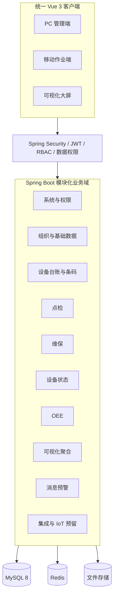
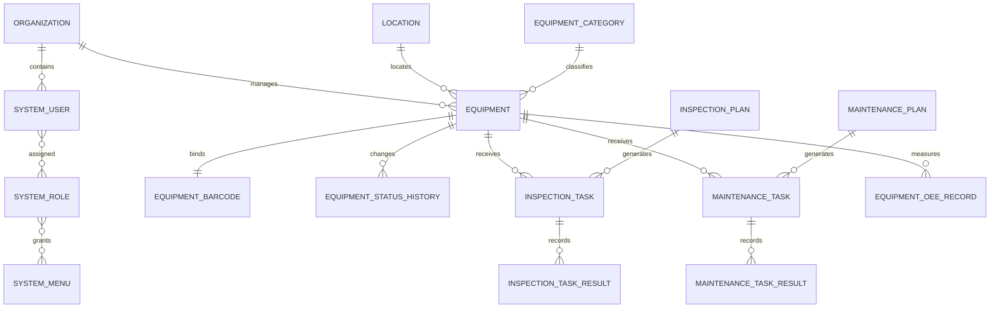

# LeanTPM V1 总体设计

## 1. 设计目标与范围

LeanTPM V1 建设“设备建档 → 条码绑定 → 点检/维保计划 → 任务执行 → 异常与状态更新 → OEE 统计 → 运行驾驶舱”的业务闭环。第一版采用模块化单体，降低部署复杂度，同时通过领域包、稳定主键、事件表和集成映射表为后续拆分服务保留边界。

基本原则：

- `equipment` 是唯一设备主数据；所有业务记录引用设备主键，不复制设备档案。
- 组织树和物理位置树分离，避免组织调整改变设备位置历史。
- 点检、维保、状态、OEE 分表建模，不使用一张“万能任务表”。
- 所有业务单据具备业务编号、租户字段、审计字段、逻辑删除和乐观锁。
- 状态使用字典或领域状态机维护；状态变化保留完整历史。
- REST API 统一使用 `/api/v1` 前缀、统一响应、分页、校验和错误码。

## 2. 总体架构



部署初期为一个前端应用、一个后端应用和一个 MySQL 数据库。Redis 用于验证码、Token 黑名单、在线用户、短时幂等键和大屏聚合缓存；文件通过统一附件服务落本地目录，接口保持与未来对象存储兼容。

## 3. 前后端目录

```text
backend/src/main/java/com/leantpm
├─ common/          统一响应、异常、审计、分页、工具
├─ security/        JWT、认证过滤器、权限表达式
├─ auth/            登录、刷新、当前用户
├─ system/          用户、角色、菜单、字典、参数、日志、附件
├─ organization/    组织与位置
├─ equipment/       分类、属性、台账、条码、状态
├─ inspection/      点检项目、方案、计划、任务、异常
├─ maintenance/     维保项目、方案、计划、任务
├─ oee/             班次、产量、停机、OEE 计算
├─ visualization/   大屏聚合与三维场景
└─ integration/     外部映射、消息日志、IoT 接口

frontend/src
├─ api/             按领域封装接口与类型
├─ assets/          样式与静态资源
├─ components/      基础组件和业务组件
├─ layouts/         管理端、移动端、大屏布局
├─ router/          静态路由和权限路由
├─ stores/          用户、权限、字典、主题状态
├─ types/           公共 TypeScript 类型
├─ utils/           请求、权限、格式化
└─ views/           按业务域组织页面
```

## 4. 领域模块与依赖

| 领域 | 职责 | 允许依赖 |
|---|---|---|
| system/auth | 用户、角色、菜单、权限、字典、参数、日志、附件 | common |
| organization | 企业组织、物理位置、班次、日历 | system |
| equipment | 设备分类、属性、台账、条码、状态历史 | organization、system |
| inspection | 点检项目、方案、计划、任务、结果、异常 | equipment、system |
| maintenance | 维保项目、方案、计划、任务、结果、用料 | equipment、system |
| oee | 生产日历、产量、停机、损失、OEE | equipment、organization |
| visualization | 只读聚合查询、三维场景映射 | 上述业务域的查询接口 |
| integration | 外部编码映射、幂等、重试、IoT 数据接收 | equipment、common |

跨领域修改通过应用服务和领域事件完成，不允许 Controller 直接访问其他领域 Mapper。

## 5. 核心业务流程

### 5.1 设备建档

分类/属性模板 → 设备建档 → 绑定组织与位置 → 上传资料 → 生成安全访问标识 → 绑定二维码 → 启用设备 → 写入初始状态和审计记录。

### 5.2 点检闭环

点检项目 → 点检方案 → 计划 → 定时生成任务 → 派工/领取 → 扫码执行 → 逐项结果 → 异常上报 → 状态联动/整改 → 审核归档。

### 5.3 维保闭环

维保项目 → 维保方案 → 周期计划 → 生成任务 → 派工 → 执行/暂停/恢复 → 用料与工时 → 结果确认 → 异常处理 → 归档并推进下次计划。

### 5.4 状态与 OEE

人工、任务或 IoT 事件 → 状态合法性校验 → 关闭上一状态记录 → 写入新状态历史 → 聚合运行/停机时长 → 录入产量与质量数据 → 计算可动率、性能率、质量率和 OEE → 驾驶舱展示。

## 6. 菜单结构

| 一级菜单 | 二级页面 |
|---|---|
| 工作台 | 我的待办、今日任务、设备状态概览、OEE 概览 |
| 设备管理 | 设备台账、设备分类、设备条码、设备状态、状态履历、设备资料 |
| 点检管理 | 点检项目、方案、计划、任务、记录、异常、统计 |
| 维保管理 | 维保项目、方案、计划、任务、记录、统计 |
| OEE 管理 | OEE 数据、产量、停机、分析、目标、损失原因 |
| 可视化中心 | 三维运行、综合驾驶舱、状态/点检/维保/OEE 大屏 |
| 消息预警 | 消息中心、预警规则、预警记录 |
| 基础数据 | 企业组织、工厂、车间、产线、工位、班次、日历、字典、编号规则 |
| 系统管理 | 用户、角色、菜单、权限、参数、附件、登录日志、操作日志 |

## 7. 权限模型

RBAC 关系为“用户 N:M 角色，角色 N:M 菜单/按钮权限”。权限码采用 `领域:资源:动作`，例如 `equipment:asset:create`、`inspection:task:execute`。

数据权限由角色配置以下一种或多种范围：全部、本工厂、本车间、本班组、本人负责设备、本人任务、指定设备分类、指定设备集合。后端在应用服务层解析当前用户的数据范围并拼入查询条件；前端隐藏按钮只改善体验，不作为安全边界。

所有设备类接口必须同时校验功能权限和设备数据范围，防止通过篡改 `equipmentId` 越权。

## 8. ER 关系说明



业务表主键使用 `BIGINT`，业务编号单独唯一索引；跨系统通过 `equipment_business_relation` 映射外部编码，不污染设备主表。

## 9. 完整数据表清单

### 9.1 系统权限

`system_tenant`、`system_user`、`system_role`、`system_user_role`、`system_menu`、`system_role_menu`、`system_data_scope`、`system_role_data_scope`、`system_parameter`、`system_dictionary_type`、`system_dictionary_item`、`system_number_rule`、`system_number_sequence`、`system_login_log`、`system_operation_log`、`system_change_log`、`system_online_user`、`system_message_template`、`system_message`、`system_warning_rule`、`system_warning_record`、`system_attachment`、`system_attachment_relation`。

### 9.2 组织位置

`organization`、`organization_user`、`position`、`position_user`、`location`、`factory`、`workshop`、`production_line`、`workstation`、`work_shift`、`production_calendar`、`production_calendar_day`。

### 9.3 设备基础

`equipment_category`、`equipment_attribute_template`、`equipment_attribute_definition`、`equipment`、`equipment_attribute_value`、`equipment_barcode`、`equipment_status_dictionary`、`equipment_status_history`、`equipment_document`、`equipment_responsible_person`、`equipment_transfer_record`、`equipment_model`、`equipment_scene`、`equipment_scene_node`。

### 9.4 点检

`inspection_item`、`inspection_scheme`、`inspection_scheme_equipment`、`inspection_scheme_item`、`inspection_plan`、`inspection_task`、`inspection_task_item`、`inspection_task_result`、`inspection_abnormal`、`inspection_attachment`。

### 9.5 维保

`maintenance_item`、`maintenance_scheme`、`maintenance_scheme_equipment`、`maintenance_scheme_item`、`maintenance_plan`、`maintenance_task`、`maintenance_task_item`、`maintenance_task_result`、`maintenance_material_usage`、`maintenance_attachment`。

### 9.6 OEE

`equipment_shift`、`equipment_calendar`、`equipment_oee_target`、`equipment_oee_record`、`equipment_output_record`、`equipment_downtime_record`、`equipment_loss_reason`、`equipment_oee_calculation_log`。

### 9.7 集成与 IoT 预留

`equipment_event`、`equipment_business_relation`、`integration_interface_config`、`integration_message_log`、`iot_device_mapping`、`iot_data_point`、`iot_data_record`。

## 10. 核心 DDL

可执行 DDL 以 Flyway 迁移为唯一来源：

- `backend/src/main/resources/db/migration/V1__system_foundation.sql`：租户、用户、角色、菜单、字典、日志、附件。
- 后续阶段分别新增迁移，不直接修改已发布迁移。

公共字段为 `id`、`tenant_id`、`created_by`、`created_time`、`updated_by`、`updated_time`、`deleted`、`version`。唯一索引包含租户维度；查询索引按状态、组织、负责人、计划时间和设备主键设计。

## 11. 核心接口

| 领域 | 方法与路径 | 说明 |
|---|---|---|
| 认证 | `POST /api/v1/auth/login` | 账号密码登录 |
| 认证 | `POST /api/v1/auth/refresh` | 刷新访问令牌 |
| 认证 | `GET /api/v1/auth/me` | 当前用户、角色、权限 |
| 认证 | `PUT /api/v1/auth/password` | 修改密码 |
| 用户 | `GET/POST /api/v1/system/users` | 分页查询/新增 |
| 用户 | `PUT /api/v1/system/users/{id}` | 编辑用户 |
| 用户 | `PATCH /api/v1/system/users/{id}/status` | 启停 |
| 用户 | `POST /api/v1/system/users/{id}/reset-password` | 重置密码 |
| 角色 | `GET/POST /api/v1/system/roles` | 查询/新增 |
| 角色 | `PUT /api/v1/system/roles/{id}` | 编辑和授权 |
| 菜单 | `GET /api/v1/system/menus/tree` | 权限菜单树 |
| 字典 | `GET/POST /api/v1/system/dictionaries` | 字典类型与字典项 |
| 日志 | `GET /api/v1/system/login-logs` | 登录日志 |
| 日志 | `GET /api/v1/system/operation-logs` | 操作日志 |
| 附件 | `POST /api/v1/system/attachments` | 安全上传 |
| 附件 | `GET /api/v1/system/attachments/{id}/content` | 下载/预览 |

后续接口按 `/equipment`、`/inspection`、`/maintenance`、`/oee`、`/visualization` 分域扩展。

## 12. 页面清单

第一阶段交付登录页、响应式管理布局、工作台、用户管理、角色管理、菜单权限、字典管理、附件管理、登录日志和操作日志。页面统一具备加载、空数据、错误、无权限、分页和防重复提交状态。

后续阶段页面按第 6 节菜单逐项建设；移动端复用同一前端工程，使用独立移动布局和卡片/分步表单，大屏使用独立布局。

## 13. 第一阶段任务拆分

1. 工程规范、环境配置、Git、Flyway 和 OpenAPI。
2. 统一响应、错误码、参数校验、分页、审计字段。
3. Spring Security、JWT 双令牌、密码加密、登录限制扩展点。
4. 用户、角色、菜单、按钮权限和数据范围基础模型。
5. 字典、参数、编号生成器基础模型。
6. 登录日志、操作日志、数据变更审计扩展点。
7. 附件上传校验、存储抽象和元数据。
8. Vue 登录、权限路由、管理布局、系统管理页面和工作台。
9. 自动化测试、真实 MySQL 联调、部署与操作说明。

## 14. 第一阶段验收标准

- 未登录访问业务接口返回 401；无权限访问返回 403。
- 管理员可登录、刷新 Token、查询当前信息并修改密码。
- 菜单与按钮权限由后端返回，API 再次校验权限。
- 用户、角色、字典支持真实 MySQL 分页 CRUD。
- 密码只存 BCrypt 哈希；首次管理员由环境变量引导初始化。
- 上传校验文件大小、扩展名和安全文件名；元数据可追溯。
- 关键写操作、登录成功和失败产生审计记录。
- 前后端构建通过，核心接口测试通过，迁移可在空库重复执行。

## 15. 启动方式与未来扩展

本地启动方式见仓库 `README.md`。生产部署建议使用反向代理提供 HTTPS，将数据库、Redis、JWT 密钥和文件目录全部通过环境变量或密钥管理注入。

未来扩展策略：

- 保持设备主数据唯一，以领域事件连接维修、备件、资产、IoT。
- 任务生成器采用可插拔周期策略，运行小时/产量触发后续接 IoT 累计值。
- 文件存储通过接口从本地磁盘切换对象存储。
- 频繁时序数据迁移到独立时序库，MySQL 仅保留事件和聚合。
- 单体负载或团队边界成熟后，按领域模块拆服务，不按技术层拆分。
- 外部集成统一通过映射表、幂等键、请求/响应日志和失败重试。
