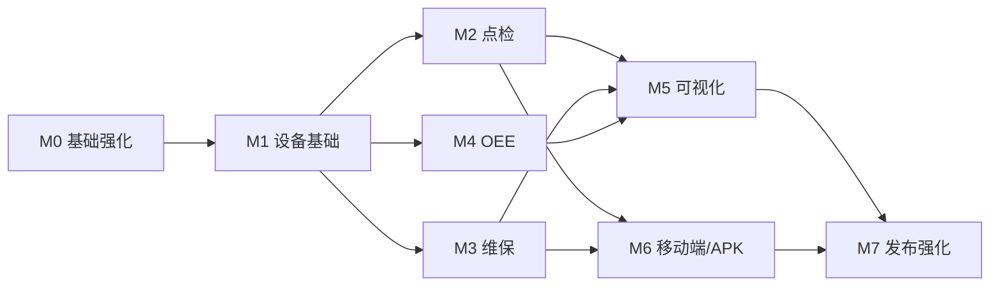

# LeanTPM V1 开发计划

## 1. 计划目标

在现有第一阶段基础工程之上，完成 LeanTPM V1 的设备基础管理、点检、维保、OEE、可视化和移动作业闭环，并满足以下交付要求：

- 所有主要功能使用真实 MySQL 数据，不以 Mock 数据代替后端能力。
- 每次数据库变更均通过不可变的 Flyway 增量迁移交付。
- 每个页面具备加载、空数据、错误、无权限和防重复提交状态。
- 每个写接口同时校验认证、功能权限和数据范围。
- 每个阶段同步交付权限点、接口文档、演示数据、测试和验收记录。
- 每个里程碑通过后形成独立 Git 提交并推送到远端。

本计划按单人全栈顺序实施估算为 59～81 个有效开发日；多人协作时，前端、后端和测试可在领域模型稳定后并行。估算不作为固定发布日期，阶段验收通过才允许进入下一里程碑。

## 2. 当前基线

截至 2026-07-30：

- 已完成 Spring Boot、Vue 3、MySQL、Flyway、JWT、RBAC 基础工程。
- 已完成用户、角色、菜单、字典、登录日志、操作日志和附件基础功能。
- 已完成响应式管理布局、工作台和系统管理页面。
- 已完成真实 MySQL 联调、构建、单元测试和 npm 安全审计。
- 已完成 Redis 会话撤销、在线用户、分布式登录限制和一次性验证码。
- 已完成参数、编号、统一数据范围、变更日志、附件关系和请求幂等。
- 已完成 OpenAPI 约束、V1～V9 真实 MySQL 集成测试和可复跑端到端验收脚本。
- M0、M1、M2、M3 已关闭，当前开发入口为 M4「OEE 管理」。

## 3. 总体路线图

| 里程碑 | 主题 | 预计工作量 | 核心验收场景 | 状态 |
|---|---|---:|---|---|
| M0 | 基础能力强化 | 3～5 日 | 安全、审计、编号与数据权限可复用 | 已完成并验收 |
| M1 | 设备基础管理 | 10～15 日 | 设备建档、二维码、状态履历 | 已完成并验收 |
| M2 | 点检管理 | 10～12 日 | 移动点检完整闭环 | 已完成并验收 |
| M3 | 维保管理 | 10～12 日 | 周期维保完整闭环 | 已完成并验收 |
| M4 | OEE 管理 | 8～10 日 | 自动计算、趋势、排名和损失 | 下一阶段 |
| M5 | 可视化中心 | 8～12 日 | 综合驾驶舱和三维设备场景 | 待开始 |
| M6 | 移动端与 APK | 5～8 日 | 扫码、离线草稿、Android 安装 | 待开始 |
| M7 | V1 发布强化 | 5～7 日 | 全场景回归、安全和部署验收 | 待开始 |

依赖顺序：

## 4. M0：基础能力强化

### 4.1 开发范围

1. Redis 安装与开发环境配置。
2. 刷新令牌轮换、退出黑名单、在线用户和分布式登录失败限制。
3. 系统参数管理与验证码开关。
4. 统一编号规则和并发安全流水号生成器。
5. 数据权限上下文、范围解析器和 MyBatis 查询约束。
6. 数据变更日志，记录关键字段变更前后内容。
7. 附件关系表和业务附件绑定服务。
8. 请求幂等键与写接口防重复提交。
9. OpenAPI 接口说明、错误码和请求示例。
10. MySQL 集成测试基线和测试数据清理策略。

### 4.2 数据库迁移

实际通过 V2～V5 四个不可变增量迁移交付：

- `system_parameter`
- `system_number_rule`
- `system_number_sequence`
- `system_data_scope`
- `system_role_data_scope`
- `system_change_log`
- `system_online_user`
- `system_attachment_relation`
- 必要的唯一索引和查询索引

### 4.3 页面与权限

- 参数配置：`system:parameter:view/manage`
- 编号规则：`system:number-rule:view/manage`
- 在线用户：`system:online-user:view/kickout`
- 数据权限：`system:data-scope:view/manage`
- 数据变更日志：`system:change-log:view`

### 4.4 验收门槛

- 退出后的访问令牌不能继续访问业务接口。
- 同一刷新令牌不能被重复使用。
- 用户只可读取其数据范围内的数据，修改资源 ID 不能越权。
- 100 个并发编号请求无重复编号。
- 重复提交同一幂等键只产生一条业务记录。
- Redis 不可用时返回明确健康状态，不造成静默数据错误。
- 后端集成测试和前端构建全部通过。

## 5. M1：设备基础管理

### 5.1 迭代拆分

#### M1.1 组织与位置

- 企业、工厂、厂区、车间、产线和工位。
- 组织树与物理位置树独立维护。
- 负责人、排序、启停和引用校验。
- 工厂、车间和产线数据权限接入。

#### M1.2 设备分类与属性模板

- 多级设备分类树。
- 属性定义、数据类型、单位、必填、默认值和校验规则。
- 分类绑定默认点检模板、维保模板、故障类型和 OEE 方式的扩展位。

#### M1.3 设备台账

- 设备新增、编辑、分页、导入、导出、复制、转移、启停。
- 基础档案、技术参数、组织位置、负责人、图片和资料。
- 生命周期阶段和关键/特种设备标识。
- 已产生业务记录的设备只允许停用，不允许物理删除。

#### M1.4 条码与状态

- 一台设备一个安全访问标识。
- 二维码生成、绑定、解绑、重新生成和批量打印。
- 当前状态、状态合法性校验、状态履历和持续时长。
- 扫码进入设备详情，按权限显示可执行动作。

### 5.2 数据库迁移

计划新增：

- `V3__organization_and_location.sql`
- `V4__equipment_category_and_attributes.sql`
- `V5__equipment_ledger_barcode_status.sql`

核心表包括 `organization`、`location`、`factory`、`workshop`、`production_line`、`workstation`、`equipment_category`、`equipment_attribute_definition`、`equipment`、`equipment_attribute_value`、`equipment_barcode`、`equipment_status_history`、`equipment_responsible_person`、`equipment_transfer_record`、`equipment_document`。

### 5.3 验收门槛

- 完成“设备建档”验收场景全部步骤。
- 完成“设备状态”验收场景全部步骤。
- 设备分页、权限过滤、导入校验和乐观锁生效。
- 二维码不包含敏感业务数据。
- 设备详情可查看档案、属性、附件、状态和操作日志。
- 数据迁移、接口、页面、权限和测试记录完整。

## 6. M2：点检管理

### 6.1 开发范围

- 点检项目与结果类型。
- 点检方案、适用分类/设备、项目清单和版本。
- 周期计划、日历、班次和定时任务生成。
- 任务派工、领取、执行、补录、审核、取消和作废。
- 数值范围校验、图片/附件、草稿和防重复提交。
- 异常上报、等级、责任人、整改、关闭和设备状态联动。
- PC 端任务管理、移动端执行和统计分析。

### 6.2 数据库迁移

已交付 `V9__inspection_management.sql`，包含：

`inspection_item`、`inspection_scheme`、`inspection_scheme_version`、`inspection_scheme_equipment`、`inspection_scheme_category`、`inspection_scheme_item`、`inspection_plan`、`inspection_task`、`inspection_task_item`、`inspection_task_result`、`inspection_abnormal`、`inspection_attachment`、`inspection_task_event`。

### 6.3 验收门槛

- 完成“移动点检”验收场景全部步骤。
- 定时任务重复执行不产生重复点检任务。
- 每个结果可追溯方案版本、标准和执行人。
- 异常项自动产生异常记录且不丢失原始结果。
- 越权用户无法执行或查看非本人范围的任务。

## 7. M3：维保管理

### 7.1 开发范围

- 维保项目、方案、等级和周期策略。
- 按日、周、月、季度、半年、年、运行小时、产量和手工触发。
- 计划暂停、恢复、取消和批量生成任务。
- 派工、转派、协同、开始、暂停、恢复、完工和确认。
- 项目结果、检测值、前后照片、工时和备件消耗。
- 逾期预警、异常处理、记录归档和统计分析。

### 7.2 数据库迁移

已交付 `V10__maintenance_management.sql`，包含：

`maintenance_item`、`maintenance_scheme`、`maintenance_scheme_version`、`maintenance_scheme_equipment`、`maintenance_scheme_category`、`maintenance_scheme_item`、`maintenance_plan`、`maintenance_task`、`maintenance_task_item`、`maintenance_task_result`、`maintenance_task_collaborator`、`maintenance_task_pause`、`maintenance_material_usage`、`maintenance_abnormal`、`maintenance_attachment`、`maintenance_task_event`。

### 7.3 验收门槛

- 完成“设备维保”验收场景全部步骤。
- 任务状态机拒绝非法跳转。
- 暂停时间不计入有效维保工时。
- 方案变更不覆盖已生成任务中的历史标准。
- 维保完成可按配置恢复设备状态并生成下一周期计划。

## 8. M4：OEE 管理

### 8.1 开发范围

- 班次、生产日历、计划停机和 OEE 目标。
- 计划时间、运行时间、停机、实际产量、良品和节拍维护。
- 损失原因、停机分类和数据校验。
- 可动率、性能率、质量率、OEE 计算与计算日志。
- 日/周/月趋势、设备/产线/车间排名和损失构成。
- 手工维护与未来 IoT 数据源的来源标识。

### 8.2 数据库迁移

计划新增 `V8__oee_management.sql`，包含：

`equipment_shift`、`equipment_calendar`、`equipment_oee_target`、`equipment_oee_record`、`equipment_output_record`、`equipment_downtime_record`、`equipment_loss_reason`、`equipment_oee_calculation_log`。

### 8.3 验收门槛

- 完成“OEE”验收场景全部步骤。
- 计算采用 `DECIMAL`，无精确计算浮点误差。
- 相同设备、日期和班次只产生一条有效 OEE 记录。
- 数据修订会重新计算并保留计算日志。
- 趋势、排名和损失构成可下钻到原始记录。

## 9. M5：可视化中心

### 9.1 开发范围

- 综合驾驶舱：设备状态、点检、维保、异常和 OEE。
- 状态、点检、维保和 OEE 专题大屏。
- 工厂、车间、产线、设备的三维层级场景。
- Three.js 模型加载、场景节点、设备绑定、状态标识和点击交互。
- SSE 或 WebSocket 实时刷新。
- 大屏聚合接口和 Redis 缓存。

### 9.2 验收门槛

- 完成“三维可视化”和“综合驾驶舱”验收场景。
- 大屏数据全部来自聚合接口，不由浏览器拼接大量明细。
- 三维模型按场景和层级按需加载。
- 状态同时使用文字、图标和颜色表达。
- 设备点击可进入详情且保留当前场景上下文。

## 10. M6：移动端与 Android APK

### 10.1 开发范围

- 工作台、扫码、任务、消息、我的底部导航。
- 点检、维保、异常上报的单手操作和分步表单。
- 相机扫码、拍照、文件选择和上传校验。
- 本地草稿、网络异常提示和恢复提交。
- Capacitor Android 容器、权限配置、构建签名和安装包。

### 10.2 验收门槛

- 手机浏览器完成登录、扫码、点检和维保。
- 网络中断时草稿不丢失，恢复后不会重复提交。
- APK 可在目标 Android 版本安装和使用。
- WebView 容器不保存明文密码和敏感业务数据。

## 11. M7：V1 发布强化

### 11.1 开发范围

- 七个业务验收场景端到端回归。
- 权限矩阵、越权、SQL 注入、XSS、上传和接口重放测试。
- 关键查询索引分析、慢 SQL 和 N+1 检查。
- 大屏缓存、并发任务生成和文件上传压力验证。
- 数据备份、恢复、部署、升级、回滚和监控文档。
- 用户操作手册、管理员手册和演示数据。

### 11.2 发布门槛

- P0、P1 缺陷清零，P2 缺陷有明确处理计划。
- 所有 Flyway 迁移在空库和已有库验证通过。
- 后端测试、前端类型检查、生产构建和依赖审计通过。
- 七个验收场景有可复验的测试记录。
- 生产密钥、数据库密码和管理员密码不进入 Git。

## 12. 每阶段固定交付物

每个里程碑结束时必须更新独立交付说明，包含：

1. 已完成与未完成功能。
2. 数据库迁移和索引说明。
3. 新增及变更接口。
4. 新增页面。
5. 权限点和数据范围。
6. 自动化测试与真实联调结果。
7. 演示数据和验证步骤。
8. 已知问题与风险。
9. 下一里程碑计划。
10. Git 提交和远端同步状态。

## 13. 工程执行规则

### 13.1 开始条件

- 业务流程、状态机和字段含义已明确。
- 数据表主键、唯一约束、索引和引用关系已评审。
- API、页面和权限点已列出。
- 上一里程碑 P0/P1 问题已关闭。

### 13.2 完成定义

一项功能只有同时满足以下条件才可标记完成：

- 后端真实业务逻辑和 MySQL CRUD 已实现。
- 前端已完成加载、空、错、无权和重复提交处理。
- 功能权限与数据权限均在后端校验。
- 数据库变更通过新 Flyway 迁移交付。
- 单元测试或集成测试覆盖核心规则。
- 前后端联调通过。
- 接口、部署和操作文档已同步。
- Git 空白检查、测试和构建通过。

### 13.3 Git 策略

- `main` 始终保持可构建、可迁移和可运行。
- 每个里程碑使用清晰的功能提交，避免混入无关改动。
- 已推送的 Flyway 迁移不得修改，只能新增迁移修正。
- 提交前执行后端测试、前端构建、依赖审计和 `git diff --check`。
- 不提交 `.env`、运行日志、上传文件、数据库密码和密钥。

## 14. 风险与前置决策

| 风险 | 影响 | 处理策略 |
|---|---|---|
| 本机无 Redis | 在线用户、黑名单、幂等和缓存无法完整验证 | M0 首先安装或提供容器化 Redis |
| 默认端口被占用 | 本地启动和联调冲突 | 通过环境变量统一端口，文档记录当前 18080/15173 |
| 数据权限复杂 | 容易产生越权或查询遗漏 | M0 建立统一范围解析，禁止各模块自行拼接 |
| 周期任务重复 | 产生重复点检/维保任务 | 业务唯一键、数据库约束和分布式锁三层保护 |
| 三维模型过大 | 首屏慢、内存高 | 模型压缩、场景分层、按需加载和资源预算 |
| APK 环境差异 | 构建或权限行为不一致 | M6 前确认 Android SDK、目标版本和签名策略 |
| 业务范围膨胀 | V1 无法按闭环完成 | 以七个验收场景为 P0，扩展需求进入后续版本 |

## 15. 目标模式推进方式

当前持续目标为：

> 按照本计划依次完成 LeanTPM V1；每阶段完成真实数据库迁移、前后端功能、权限、测试、文档、Git 提交与验收。

目标推进规则：

- 当前默认执行里程碑为 M3。
- M0 已验收完成，后续业务模块必须复用其编号、会话、数据权限、变更日志、附件关系和幂等能力。
- 每次继续目标时先读取本计划和上一阶段交付说明。
- 遇到不影响领域模型的细节，按最佳判断直接推进。
- 只有涉及业务范围变化、生产级外部资源或不可逆操作时请求用户确认。
- 目标仅在 M7 发布门槛全部满足后标记完成。
