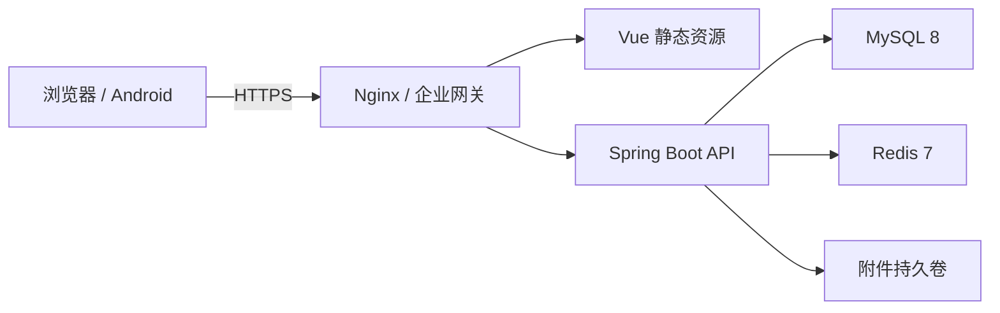

# LeanTPM V1 发布与运维手册

## 1. 发布拓扑

生产环境建议采用“HTTPS 反向代理 + 静态前端 + Spring Boot API + MySQL 8 + Redis 7 + 独立附件目录”：



反向代理必须终止 TLS、传递 `X-Forwarded-Proto`，并限制 API 请求体大小。MySQL、Redis 和附件卷不暴露到公网。

## 2. 生产环境变量

必填：

- `LEANTPM_DB_URL`、`LEANTPM_DB_USERNAME`、`LEANTPM_DB_PASSWORD`
- `LEANTPM_REDIS_HOST`、`LEANTPM_REDIS_PORT`、`LEANTPM_REDIS_PASSWORD`
- `LEANTPM_JWT_SECRET`：至少 32 字节的高熵随机值
- `LEANTPM_CORS_ALLOWED_ORIGINS`：逗号分隔的 HTTPS 前端源
- `LEANTPM_UPLOAD_DIR`：持久化附件目录

建议：

- `LEANTPM_OPENAPI_ENABLED=false`
- `LEANTPM_REDIS_HEALTH_ENABLED=true`
- `LEANTPM_ACCESS_TOKEN_MINUTES=30`
- `LEANTPM_REFRESH_TOKEN_DAYS=7`
- `LEANTPM_MAX_LOGIN_FAILURES=5`

首次初始化才设置 `LEANTPM_BOOTSTRAP_ADMIN_PASSWORD`；管理员生成后立即移除该变量并修改初始密码。密钥和密码只能来自部署平台的 Secret 管理，不写入 Git、镜像或日志。

## 3. 发布门禁

```powershell
.\scripts\verify-release.ps1 `
  -MySqlUser root `
  -MySqlPassword '本机测试密码'
```

该脚本检查 Git 空白、后端测试、V1～V32 空库迁移、全部 MySQL 业务集成场景、关键索引、前端类型/构建及 npm 高危漏洞。接入 Android SDK 36 时可追加 `-IncludeAndroid`。

发布条件：

- P0、P1 缺陷为 0；
- 所有迁移在空库通过，已有库升级前已备份；
- 后端测试、全部 MySQL 集成测试、前端类型检查/构建和依赖审计通过；
- APK 的包名、SDK、签名和 SHA-256 已记录；
- 生产 Secret、域名、证书、附件卷和监控告警已配置。

## 4. 数据库备份与恢复

升级前备份：

```powershell
.\scripts\backup-mysql.ps1 `
  -MySqlUser root `
  -MySqlPassword '数据库密码' `
  -Database leantpm
```

脚本使用一致性快照，包含触发器、存储过程和事件，并输出 SHA-256。备份文件默认位于不进入 Git 的 `runtime/backups`；生产环境应复制到加密、异地、受访问控制的备份库。

恢复必须使用已存在的空数据库，并要求两次输入相同库名：

```powershell
.\scripts\restore-mysql.ps1 `
  -BackupFile D:\backup\leantpm.sql `
  -Database leantpm_restore `
  -ConfirmDatabase leantpm_restore `
  -MySqlUser root `
  -MySqlPassword '数据库密码'
```

禁止直接在生产库验证恢复。至少每季度在隔离环境演练，核对 `flyway_schema_history` 最新成功版本、核心表数量、管理员登录和附件可读性。

## 5. 升级步骤

1. 宣布维护窗口并停止写流量。
2. 检查当前应用版本、Flyway 版本、数据库容量和磁盘余量。
3. 执行数据库与附件目录备份，记录 SHA-256。
4. 在隔离库恢复备份并运行新版本 Flyway 校验。
5. 部署新后端；Flyway 只能前向执行不可变迁移。
6. 部署带哈希文件名的前端静态资源，再切换入口 HTML。
7. 检查 `/actuator/health`、登录、设备扫码、点检、维保、OEE 和大屏。
8. 恢复写流量并观察错误率、延迟和连接池至少 30 分钟。

## 6. 回滚策略

应用回滚与数据库回退分开处理：

- 无数据库变更：切回上一版本应用与前端资源；
- 有前向兼容迁移：优先切回兼容的上一版本应用，数据库保持新版本；
- 不兼容迁移或数据损坏：停止写流量，在新库恢复升级前备份，验证后切换连接；
- 不允许手工删除 Flyway 历史或修改已应用迁移脚本。

回滚后保留失败版本日志、数据库备份和时间线，完成根因分析后才能重新发布。

默认恢复目标为 RPO 不超过 24 小时、RTO 不超过 4 小时。关键生产环境应启用 MySQL binlog 和异地增量备份，将 RPO 缩短到 15 分钟以内；最终指标由客户业务负责人、基础设施负责人和项目负责人在上线评审中共同确认。

## 7. 监控与告警

至少监控：

- HTTP 5xx、401/403 异常峰值、P95/P99 延迟；
- JVM 堆、GC、线程、进程重启；
- Hikari 活跃/等待连接与获取超时；
- MySQL CPU、连接、慢 SQL、锁等待、复制延迟和磁盘；
- Redis 可用性、内存、命中率和过期键；
- 点检/维保任务生成失败、幂等冲突和附件写入失败；
- 附件卷使用率与备份成功率。

建议阈值：5xx 连续 5 分钟超过 1%、P95 超过 2 秒、数据库连接池等待持续增长、磁盘超过 80% 时告警。

日志不得记录密码、JWT、刷新令牌、验证码、数据库连接密码和附件正文。生产日志至少保留 30 天，审计日志按企业合规要求保留。

## 8. 安全基线

- 仅开放 HTTPS，HTTP 强制跳转；
- CORS 只列出明确 HTTPS 源，不使用 `*`；
- 关闭生产 OpenAPI，限制 Actuator 仅暴露 health/info；
- API 返回 CSP、HSTS、X-Frame-Options、Referrer-Policy 和 Permissions-Policy；
- 上传使用扩展名白名单、大小限制、随机存储名、路径归一化和 SHA-256；
- MySQL/Redis 使用独立最小权限账号，定期轮换；
- Android 发布包使用企业 keystore，正式清单禁止明文 HTTP；
- 每次发布执行依赖审计、越权回归和备份恢复演练。

## 9. 性能检查

发布前对高频查询执行 `EXPLAIN ANALYZE`：

- 我的点检/维保任务；
- 设备台账与条码查询；
- OEE 日期区间与设备排名；
- 大屏聚合和场景节点；
- 登录日志、操作日志和附件列表。

出现全表扫描、估算行数明显偏大或临时表/文件排序时，先补查询条件和复合索引，再进行压测。禁止在生产高峰直接创建大表索引。

## 10. Android 发布

发布包使用 `scripts/build-android.ps1 -Configuration Release` 构建。上线前记录：

- versionCode/versionName；
- applicationId；
- targetSdk/minSdk；
- 签名证书 SHA-256；
- APK/AAB SHA-256；
- 后端 HTTPS 地址；
- 真机登录、扫码、拍照、断网草稿和恢复提交结果。

## 11. 容量、网络与 Android 基线

- 标准生产环境按 100 并发设计，最低不得以 2 核 4GB 作为生产服务器；详细的单机、标准分离和高可用配置、容量公式与扩容阈值见 `docs/18-生产部署容量与Android兼容规格.md`；
- 附件卷至少保留 30% 可用空间，数据库数据盘与附件盘分离；
- 公网只开放 443，8080、3306、6379 仅允许受控内网访问；
- Nginx、systemd 和环境变量示例见 `deploy/`，复制后必须替换域名、路径、运行账户及全部 Secret；
- Android 最低为 Android 10 / API 29，compileSdk/targetSdk 为 36；正式端只连接受信任 HTTPS，调试版 HTTP 能力不得进入生产包。
