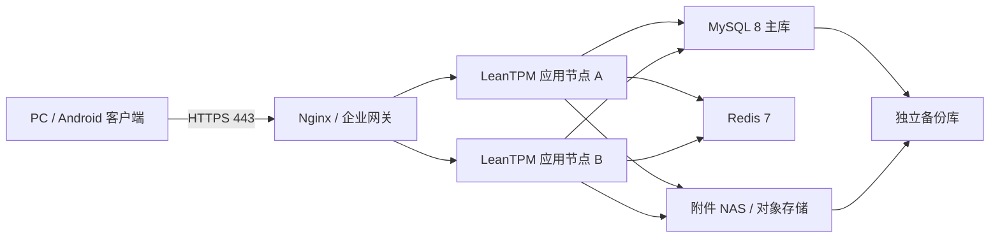

# LeanTPM 生产部署容量与 Android 兼容规格

## 1. 适用范围与容量假设

本规格用于客户内网或私有云生产部署，不把 2 核 4GB 开发配置作为生产配置。标准容量按以下三年规模设计：100 个同时在线用户、1000 个账号、5000 台设备、每日 3 万个点检任务、每日 1 万张照片、单张压缩后 1.5MB、在线保留 36 个月。若实际任一指标超过 150%，上线前必须重新压测和核算存储。

附件同时保留原图和水印图，容量按双份计算：`日照片数 × 平均单图大小 × 2 × 保留天数 × 1.3`。按上述假设约为 42.7TB，因此标准服务器的 8TB 在线附件盘只适合较低照片量或较短在线周期；必须配套归档策略，或按实际照片量扩容 NAS/对象存储。

## 2. 推荐生产拓扑

标准方案采用应用、数据库、附件和备份故障域分离：

## 3. 服务器配置分档

| 场景 | 适用规模 | 应用层 | 数据库 | Redis | 附件与备份 |
|---|---|---|---|---|---|
| 开发/演示（非生产） | ≤10 并发、≤500 台设备 | 4 vCPU / 8GB，可与 MySQL 共机 | 共享实例，数据盘 200GB SSD | 可选 1GB | 附件 500GB；不承诺高可用 |
| 小型单机生产 | ≤30 并发、≤1500 台设备 | 1 台 8 核 / 32GB ECC，应用与数据库逻辑隔离 | MySQL 8，Buffer Pool 10～12GB，独立 500GB NVMe/企业 SSD | 1～2GB | 附件 4TB RAID1；独立备份 6TB |
| 标准生产（推荐） | ≤100 并发、≤5000 台设备 | 2 台，每台 4 vCPU / 8GB；或物理机虚拟化等价资源 | 1 台 8 vCPU / 32GB ECC，独立 500GB～1TB NVMe/企业 SSD；建议增加同规格只读/灾备副本 | 2 vCPU / 4GB，持久化开启 | 附件 8TB 可用 RAID10/NAS；独立备份 ≥12TB |
| 高可用扩展 | 100～300 并发、5000～20000 台设备 | 3 台，每台 8 vCPU / 16GB | 主从各 16 vCPU / 64GB，数据卷 1～2TB NVMe，半同步复制 | 3 节点 Sentinel/集群，每台 4 vCPU / 8GB | 双控制器 NAS/对象存储 20TB 起；异地备份按 1.5 倍在线量 |

若客户只能提供一台标准物理服务器，最低建议为 16 个物理核心、64GB ECC 内存、2×960GB SSD RAID1（系统/应用/数据库）和 4×4TB 企业盘 RAID10（附件），另备一台或一套不同故障域的备份存储。生产环境不接受单盘和无备份部署。

## 4. 软件与系统要求

| 项目 | 要求 |
|---|---|
| CPU 架构 | x86_64，支持硬件虚拟化；不使用超售严重的共享突发实例 |
| 操作系统 | Ubuntu Server 24.04 LTS、Rocky Linux 9 或 AlmaLinux 9；64 位、最小化安装 |
| Java | OpenJDK 21 LTS |
| 数据库 | MySQL 8.0.36 及以上 8.0 LTS 维护版本，字符集 utf8mb4，时区 Asia/Shanghai |
| 缓存 | Redis 7.x，开启认证、持久化和内存上限 |
| 网关 | Nginx 1.24+ 或企业同等级反向代理，只开放 HTTPS 443 |
| 时间 | 全部节点使用同一企业 NTP，时间偏差不超过 30 秒 |
| 文件系统 | XFS 或 ext4；数据库和附件使用独立卷，禁止写入容器临时层 |

JVM 初始值建议 `-Xms2g -Xmx6g`（8GB 应用节点）或 `-Xms4g -Xmx12g`（16GB 应用节点），容器内存上限至少高于 `Xmx` 2GB。MySQL Buffer Pool 设为数据库节点内存的 50%～60%，最大连接数由连接池总量反推，不盲目设大。

## 5. 网络、安全和端口

- 客户端只访问 HTTPS 443；HTTP 80 只用于跳转或完全关闭。
- 应用 8080、MySQL 3306、Redis 6379、SSH 22 仅允许管理网或明确的安全组来源。
- 正式证书必须包含 Android 使用的完整中间证书链，禁止自签名证书直接下发普通终端。
- MySQL、Redis 使用独立最小权限账号；密钥由 Secret 管理，禁止写入 Git、镜像和日志。
- 生产关闭 OpenAPI 和 WebView 调试；Actuator 仅允许监控网访问 health/info。

## 6. 备份、恢复与归档

- MySQL 开启 binlog；每日全量备份，15 分钟增量/binlog 归档，保留 35 天。
- 附件每日增量、每周全量；审计与结果数据按客户合规期限保留。
- 备份必须加密，并至少有一份位于生产服务器之外的故障域。
- 目标为 `RPO ≤ 15 分钟`、`RTO ≤ 4 小时`；每季度执行隔离恢复演练。
- 附件卷使用率 70% 预警、80% 告警、85% 必须扩容或归档；数据库卷使用率不得超过 75%。

## 7. 性能验收

标准生产配置上线前至少执行 100 并发、持续 30 分钟的混合场景压测，覆盖登录、设备查询、点检列表、提交、图片上传、异常查询和看板。验收门槛：业务接口错误率低于 0.5%，普通查询 P95 不超过 2 秒，提交/上传 P95 不超过 5 秒，无连接池耗尽、长时间锁等待和 JVM OOM。

## 8. Android 系统与硬件要求

| 项目 | 最低要求 | 推荐要求 |
|---|---|---|
| Android | Android 10 / API 29 | Android 12～16 / API 31～36 |
| CPU | arm64-v8a，64 位 ARM 八核 | 近五年主流高通/联发科/三星 64 位平台 |
| 内存 | 4GB | 6GB 以上 |
| 存储 | 64GB，应用可用空间 ≥2GB | 128GB，应用可用空间 ≥5GB |
| 屏幕 | 5.5 英寸、720×1280 | 6 英寸以上、1080P，系统显示缩放 100%～150% |
| 摄像头 | 后置 800 万像素、自动对焦 | 1200 万像素以上，支持连续自动对焦 |
| 网络 | 2.4/5GHz Wi-Fi 或 4G | Wi-Fi 5/6 + 4G/5G |
| WebView | Android System WebView 可由 MDM 更新 | 保持厂商当前安全维护版本 |

构建基线固定为 `minSdk 29`、`compileSdk 36`、`targetSdk 36`，主 ABI 为 `arm64-v8a`。正式权限只允许网络、相机和 Android 13+ 通知，不申请 GPS、通讯录、短信或全盘存储权限。

## 9. 主流终端兼容矩阵

正式验收至少覆盖：小米/Redmi（MIUI 或 HyperOS）、OPPO/一加（ColorOS）、vivo/iQOO（OriginOS）、荣耀（MagicOS）、三星（One UI）以及一款客户现场工业终端。系统版本至少覆盖 Android 10、12、13、14、15、16 中客户实际使用的版本；每个主版本至少一台真机。

华为终端仅在能正常安装和运行 Android APK、具备兼容 Android WebView 的型号上纳入；HarmonyOS NEXT 原生应用不属于本期。工业终端必须验证相机自动对焦、二维码识别、系统 WebView、证书链、休眠唤醒和弱网切换。

## 10. Android 发布与验收

- 客户持有企业 keystore；相同包名升级必须使用同一签名。
- 正式包只允许 HTTPS；调试包的局域网 HTTP 开关不能进入正式包。
- 每次发布记录 applicationId、versionCode、versionName、minSdk、targetSdk、APK 大小、APK SHA-256 和签名证书 SHA-256。
- 验收用例包括安装/覆盖升级、登录、扫码、手工创建点检、拍照水印、附件预览、断网草稿、恢复同步、异常提醒、设备状态、个人报表和强制升级。
- 普通版本允许选择升级；安全漏洞、接口不兼容或最低版本策略命中时强制升级。

## 11. 扩容触发条件

以下任一条件连续 7 天出现即启动容量评审：应用 CPU P95 超过 65%、JVM 堆长期超过 70%、MySQL CPU P95 超过 60%、慢查询超过请求量 1%、附件卷超过 70%、日任务量或日照片量超过设计值 150%、同时在线用户超过设计值 120%。优先横向扩展无状态应用节点，再扩数据库读副本和存储；数据库写扩展必须经过专项设计。
