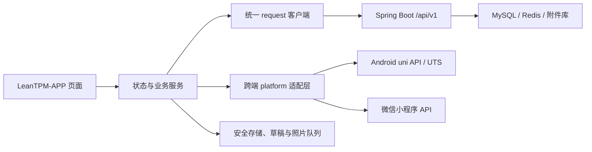

# LeanTPM-APP uni-app 迁移开发方案

## 1. 文档信息

| 项目 | 内容 |
|---|---|
| 目标项目 | `LeanTPM-APP` |
| 技术路线 | 经典 uni-app、Vue 3；Android 为本期交付端，兼容 H5 与未来微信小程序 |
| 迁移来源 | `frontend/src/views/mobile`、`frontend/src/views/inspection/mobile` 及 Capacitor 原生能力 |
| 保留范围 | PC Web、Spring Boot 后端、MySQL 数据模型、既有 REST API、旧 Capacitor APP |
| 当前不交付 | iOS、HarmonyOS NEXT、微信小程序正式发布、完整保养和完整报修业务 |
| 分支 | `codex/uniapp-migration` |

## 2. 迁移目标与原则

本次不是在原 `frontend` 中替换框架，而是在同一仓库新增独立的 `LeanTPM-APP`。PC Web 继续使用 Vue 3、Element Plus 和 Vue Router；新移动端使用 uni-app 页面、组件和跨端 API，共用后端接口与业务规则。

迁移遵循以下原则：

1. 旧 APP 在新端功能等价、真机验证和企业签名覆盖升级通过前继续保留。
2. 页面不得直接依赖 `window`、DOM、Element Plus、Vue Router 或 Capacitor API。
3. 平台差异集中在 `platform` 适配层，业务页面不得散落原生判断。
4. Token、离线草稿、照片队列、幂等键和服务地址采用统一存储接口。
5. Android 不申请 GPS、通讯录、短信、电话状态和全盘存储权限。
6. 生产端只允许 HTTPS；局域网 HTTP 仅用于开发调试。
7. 服务端继续作为权限、数据范围、任务状态和幂等约束的最终裁决方。
8. 保养、报修只展示“尚未开发”，不得形成伪业务闭环。

## 3. 总体架构



推荐目录：

```text
LeanTPM-APP/
├── api/                 REST 接口模块
├── components/          跨端业务组件
├── constants/           主题、状态、路由常量
├── pages/               uni-app 页面
├── platform/            扫码、相机、网络、通知、安全存储适配
├── services/            认证、同步、水印、版本策略
├── static/              Logo、图标等静态资源
├── stores/              轻量全局状态
├── types/               JSDoc/TypeScript 业务类型
├── utils/               时间、校验、幂等、错误处理
├── App.vue
├── main.js
├── manifest.json
└── pages.json
```

## 4. 现有能力迁移映射

| 当前能力 | 新实现 | 说明 |
|---|---|---|
| Axios 拦截器 | `api/request.js` + `uni.request` | Bearer Token、刷新令牌、超时、统一错误、幂等键 |
| Vue Router | `pages.json` + `uni.navigateTo/reLaunch/switchTab` | 登录守卫由启动页和认证服务执行 |
| Pinia 移动 Store | `stores/session.js`、`stores/mobile.js` | 避免首期额外依赖，使用 Vue reactive 单例 |
| Capacitor Barcode | `platform/scanner.js` + `uni.scanCode` | 只接受 LeanTPM 64 位设备令牌 |
| Capacitor Camera | `platform/camera.js` + `uni.chooseImage` | 拍摄、压缩、临时文件读取和上传 |
| HTML Canvas 水印 | uni Canvas / App Canvas 适配 | 水印包含品牌、设备、任务、服务时间、执行人、设备档案位置 |
| SecureVaultPlugin | `platform/secure-storage.js` | 开发阶段统一接口；Android 正式包接 Keystore/UTS，微信使用平台存储 |
| Capacitor Network | `platform/network.js` | 网络监听驱动草稿和照片队列恢复 |
| LocalAlertsPlugin | `platform/notification.js` | Android 本地提醒；微信端降级为站内消息 |
| IndexedDB 草稿 | 版本化本地 JSON 草稿 | 设容量上限、过期时间、用户和服务地址隔离 |
| Web Blob/File | `uni.uploadFile`、`uni.downloadFile` | 附件上传、下载和预览均使用临时文件路径 |

## 5. 功能范围

### 5.1 基础与认证

- 企业服务地址配置、规范化、连通性测试和历史保存。
- 账号密码登录、验证码兼容、Token 刷新、退出、会话过期跳转。
- 首次登录修改密码提示与处理。
- 当前用户、权限列表、移动端开关和企业品牌加载。
- Android 网络状态、弱网提示和恢复同步入口。

### 5.2 工作台和设备

- 全厂设备运行、停机、故障、离线统计。
- 本人今日应检、待办、超期、今日完成、异常统计。
- 最近消息、草稿数量、待上传照片数量。
- 设备状态列表、筛选、刷新和设备详情。
- 二维码扫描、令牌校验、扫码设备现场信息和活动任务。
- 扫码手工创建点检任务；保养、报修按钮显示“尚未开发”。

### 5.3 点检执行

- 我的任务全部、待执行、执行中、待复核、已超期分页查询。
- 任务详情、设备和方案快照、多人执行人、项目完成度和事件。
- 定性项目合格/不合格；定量项目数值输入并按上下限形成异常建议。
- 文本、单选、多选、图片/附件类项目兼容。
- 必填、允许跳过、照片数量/大小/格式、异常停机规则校验。
- 任一执行人提交即完成；重复并发提交按服务端最终状态处理。
- 待复核任务只读展示，PC 端继续承担管理复核能力。

### 5.4 图片、附件、异常和离线

- 现场拍照、压缩、原图与水印图上传。
- 水印使用设备档案位置，不读取 GPS。
- 点检任务和异常中的附件列表、图片预览和文件打开。
- 离线草稿自动保存，按服务地址、用户和任务隔离。
- 照片上传队列与任务提交队列使用稳定幂等键；联网后按照片优先、任务后提交恢复。
- 异常列表、严重度、处理状态和当前用户关联范围。

### 5.5 消息、报表和设置

- 站内消息列表、已读/待确认状态及业务跳转。
- 个人近 30 天点检应检、完成、异常和完成率。
- 服务地址、当前版本、网络状态、账号信息、退出登录。
- 普通升级和强制升级策略；Android 下载入口，微信端提示版本更新方式。

## 6. 跨端策略

| 能力 | Android APP | 微信小程序 | 降级策略 |
|---|---|---|---|
| 服务地址 | 用户配置内网/HTTPS | 固定合法 HTTPS 域名 | 小程序隐藏任意地址输入，使用构建配置 |
| 登录 | LeanTPM 账号密码 | LeanTPM 账号密码 | 暂不接微信 OAuth |
| 扫码 | `uni.scanCode` | `uni.scanCode` | 无相机权限时允许手工输入令牌 |
| 拍照 | 相机优先，可选相册 | `chooseMedia/chooseImage` | 不支持时允许稍后补传 |
| 水印 | Canvas 生成 | Canvas 生成 | 均不读取 GPS |
| 通知 | 本地通知/站内消息 | 站内消息 | 小程序订阅消息另立需求 |
| 安全存储 | Android Keystore 适配 | 小程序隔离存储 | Token 不写日志，退出即清除 |
| APP 升级 | 版本策略与 APK 下载 | 微信平台版本机制 | 页面只展示当前版本 |

## 7. API 与数据约束

- API 根路径固定为 `{server}/api/v1`。
- 连通性使用公开接口 `GET /auth/captcha`，不能以需要登录的业务接口判断服务器不可用。
- 所有写请求自动生成 `Idempotency-Key`；离线重试必须复用原键。
- 401 时只允许单飞刷新一次；刷新失败清除会话并返回登录页。
- 403 展示权限不足，409 展示任务已被他人完成或版本冲突，422 展示业务校验信息。
- 服务地址变化后必须清除 Token、用户、草稿索引和待上传队列，防止跨企业数据混用。
- 照片元数据记录设备时间、服务参考时间、时钟偏差、设备位置和水印文本。

## 8. 安全与权限

- Android 目标基线：minSdk 29、targetSdk 36、arm64-v8a。
- 初始权限仅为网络、网络状态和相机；通知权限在消息功能落地时按 Android 13+ 动态申请。
- 禁止定位、电话状态、联系人、短信、账号、日志和全盘存储权限。
- 调试包名为 `com.leantpm.mobile.uniapp.dev`；正式切换才使用 `com.leantpm.mobile`。
- 正式 APK 使用客户企业 keystore；不得把 keystore、密码或生产服务地址提交 Git。
- 旧 Capacitor 本地 Token 和离线草稿不直接迁移；升级前要求全部同步，升级后重新登录。

## 9. 测试策略

1. 纯函数单测：地址规范化、二维码解析、幂等键、状态映射、定量判定、水印文本和草稿版本。
2. API 合约测试：使用 Mock `uni.request/uploadFile/downloadFile` 验证认证、刷新、错误和上传流程。
3. H5 构建：验证 Vue 模板、路由注册和通用代码编译。
4. 微信开发构建：验证条件编译、分包与小程序 API 兼容性。
5. Android 基座：登录、扫码、拍照、附件预览、断网恢复和后台唤醒。
6. Android APK：权限、包名、版本、签名、安装与覆盖升级。
7. 后端回归：复用现有全量 MySQL 集成测试，确保迁移不改变服务端规则。

## 10. 切换与回退

正式切换前必须满足：新 APP 功能追踪矩阵全部通过、无未同步草稿、客户真机矩阵通过、企业签名覆盖升级通过、生产 HTTPS 通过、旧 APP 停止新增版本但保留安装包和源代码。切换失败时回退旧 APK 和原前端资源；服务端 API 与数据库不回滚，因为本次优先复用现有兼容接口。

只有上述门禁全部满足后，才允许删除 `frontend/android` 和 Capacitor 依赖。本轮开发完成不自动执行该删除。
