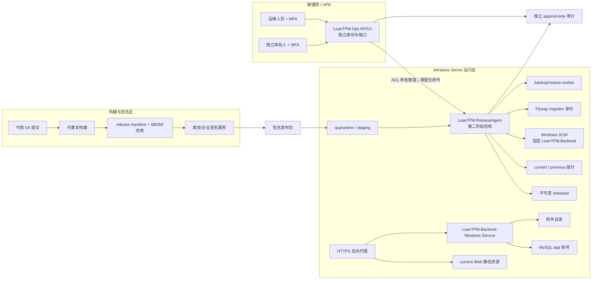

# LeanTPM 发布平台总体架构

## 1. 目标与阶段边界

本架构把“构建签名”“服务器发布”“业务运行”和“运维控制”分成不同信任域。第一阶段交付离线、人工确认、可验证和可回滚的 Windows Server 工具链；第二阶段才建设独立 Ops API/UI 与受限 ReleaseAgent；第三阶段的蓝绿、高可用和异地灾备必须另行批准。

第一阶段不能把现有业务后端中的 Android APK 上传功能扩权为主机控制面。它复用业务 JWT、业务数据库和附件存储，只适合业务内 APP 分发，不具备独立认证、服务控制、迁移、备份和不可抵赖审计边界。

## 2. 逻辑架构



第一阶段在没有 Ops/Agent 服务时，由本机管理员手工运行同一套白名单 PowerShell 入口。脚本默认 `ConfirmImpact=High`，支持 `-WhatIf`，输入仍只能是 releaseId、manifest 路径、固定 serviceId、backupId 和批准根目录。人工脚本是过渡控制面，不提供远程任意命令接口。

## 3. 进程、网络和数据边界

| 边界 | 身份与权限 | 可访问 | 禁止 |
|---|---|---|---|
| 构建器 | CI/离线构建身份 | 源码、依赖缓存、测试签名引用 | 生产 Secret、生产 DB、服务控制 |
| 签名器 | 企业签名服务/离线签名人 | manifest 摘要、正式 APP 制品 | 服务器运行权限、业务 DB |
| HTTPS 代理 | 专用服务身份 | 443、Web 只读、Backend loopback | DB、Secret 值、发布目录写入 |
| Backend | `NT SERVICE\LeanTPM.Backend` 或 gMSA | current 版本只读、config 引用只读、uploads 读写、app DML | SCM 控制、migrator/backup 凭据、staging 写入 |
| ReleaseAgent | 受限 service SID | 固定服务 Query/Start/Stop、staging/releases/current、migrator/backup job | 任意服务名、任意 shell/SQL、业务 JWT |
| Migrator | 短期独立 DB 身份 | 目标 schema 的 Flyway validate/migrate | 业务用户管理、备份存储、长期凭据 |
| Backup | 独立备份身份 | DB 一致性读取、uploads 读取、备份库写入 | 应用 DML、服务控制、备份删除 |
| Ops | 独立 OIDC/AD + MFA | 发布记录、审批、健康、审计、Agent 管道 | 业务 JWT、业务用户表、直接 DB 管理、任意命令 |

建议目录：

```text
D:\LeanTPM\App\
├─ service\                 # 固定、受信任 WinSW 与 XML；日常升级不改
├─ proxy\                   # 固定 Caddy/WinSW；独立 Proxy gMSA，只读 Web
└─ releases\<version>\     # 逐项受保护 DACL；Backend RX，Proxy 仅根/payload/Web RX
D:\LeanTPM\Runtime\
├─ staging\                 # Agent 写；导入后先隔离验证
├─ pointers\                # current/previous 小型原子状态文件或 junction
├─ config\                  # 非敏感配置和 Secret 引用
├─ secrets\                 # DPAPI/Vault 引用目标；仅管理员与 Backend gMSA 可读
├─ state\                   # recovery inhibit；Backend 只读、发布工具写
├─ proxy\                   # Caddy 配置、TLS state 与日志；仅 Proxy gMSA
├─ data\uploads\           # 业务附件
├─ logs\                    # 业务日志
├─ audit\                   # 追加式审计；业务账户不可删
└─ backups\                 # 本机临时备份；正式副本需异故障域
```

所有脚本必须解析绝对路径并验证目标位于批准根目录内；拒绝 `..`、符号链接/重解析点逃逸、大小写碰撞、未知额外文件、自由服务名、自由命令和自由 SQL。

## 4. 发布状态机

```text
IMPORTED
  -> VERIFIED
  -> AWAITING_APPROVAL
  -> APPROVED
  -> PREFLIGHTED
  -> BACKUP_VERIFIED
  -> STAGED
  -> MIGRATED
  -> SWITCHED
  -> STARTING
  -> VERIFYING
  -> SUCCEEDED
  -> FINALIZED
```

- `SWITCHED` 前失败进入 `ABORTED`，线上指针和服务保持不变。
- `SWITCHED` 后健康失败进入 `ROLLBACK_PENDING -> ROLLING_BACK -> ROLLED_BACK`。
- migration 不向后兼容、Contract 已执行或数据损坏时进入 `RECOVERY_REQUIRED`，禁止自动覆盖式恢复。
- 同一 releaseId 成功后重复提交返回原结果；不同 releaseId 同时执行必须被全局租约拒绝。
- 审计写入失败视为发布失败，不能“只告警后继续”。

## 5. Windows Service 状态机

```text
UNINSTALLED -> INSTALLING -> STOPPED -> START_PENDING -> RUNNING
RUNNING -> STOP_PENDING -> STOPPED -> UNINSTALLING -> UNINSTALLED
任一步 -> FAILED / DEGRADED
```

Java JAR 不能直接注册成原生 Windows Service。推荐 WinSW，但必须固定版本并在导入时校验来源、SHA-256 和 Authenticode/发行签名。服务包装器路径稳定，日常升级只切换 `current`，安装/卸载是独立管理员仪式。

SCM 报告 `Running` 只表示进程存在；发布成功还要求 readiness 通过。Stop 超时不得默认杀进程，强制终止属于 break-glass 双人审批。

## 6. 健康模型

- startup：进程是否完成初始化；启动窗口内失败不接流量。
- liveness：进程线程与核心运行时是否存活；不把 MySQL 短暂故障加入 liveness，避免重启风暴。
- readiness：DB、附件目录、schema/配置兼容和应用可服务状态；DOWN 时代理停止送入新流量。
- `/actuator/health`：兼容旧监控，只暴露最小聚合状态。
- `/actuator/health/liveness`、`/readiness`：只允许 loopback、监控网或代理 ACL；不公开详细组件、主机名、连接串或 Secret。

## 7. STRIDE 与供应链控制

| 类别 | 控制 |
|---|---|
| Spoofing | 独立 IdP audience/issuer、MFA、管理网、命名管道 ACL、短期 job token、签名证书固定 |
| Tampering | detached signature、逐文件 SHA-256、不可变 release 目录、Flyway checksum、备份清单、审计哈希链 |
| Repudiation | actor/approver 分离，记录请求摘要、前后状态、退出码、release/backup digest 和 correlation id |
| Information disclosure | manifest 只存 Secret 引用；禁止密码入 argv；结构化脱敏；备份加密；签名私钥不入服务器 |
| Denial of service | 单发布租约、包大小/磁盘/端口预检、超时、安全点取消、旧版本保留、健康门禁 |
| Elevation of privilege | 无 shell API、强类型 ID、根目录 allowlist、固定 SCM SDDL、app/migrator/backup/ops 账号分离 |
| Supply chain | npm ci、工具链锁、Gradle distribution SHA、HBuilder 编译器摘要、WinSW 固定摘要、SBOM/来源证明 |

## 8. 命令白名单

第二阶段 API/Agent 仅允许以下版本化命令枚举：

- `ImportRelease`、`VerifyRelease`、`PreflightRelease`、`StageRelease`、`ActivateRelease`、`RollbackApplication`；
- `QueryBackendService`、`StartBackendService`、`StopBackendService`、`RestartBackendService`，目标固定为 `LeanTPM.Backend`；
- `CreateBackup`、`VerifyBackup`、`CreateRestorePlan`、`RestoreToNewTarget`；
- 受限日志游标读取与健康查询。

生产 deploy、restore、uninstall、break-glass kill 必须双人审批。发起人与审批人不能相同，job 含 nonce、expiry、manifest digest、actor、approver 和幂等键。

## 9. 故障与回滚类

| 变更类 | 回滚方式 |
|---|---|
| 无 DB 变更 | 切 previous 指针，重启固定服务，验证 readiness |
| Expand/前向兼容 DB | 保留新 schema，回切兼容旧应用；优先前滚修复 |
| Migrate 数据回填 | 暂停/续跑或运行幂等补偿；应用按兼容矩阵回切 |
| Contract/不兼容 DB | 不自动回切应用；停止写入，在新隔离库恢复备份并验证后切换 |
| 配置错误 | 恢复上一配置引用与指针；Secret 值由 provider 轮换，不从包恢复 |
| 备份或审计失败 | 切换前中止，保持旧版本运行 |

## 10. 残余风险

第一阶段仍有单机停机、人工误操作、同机临时备份相关失效、管理员绕过 ACL、缺少集中实时告警，以及 Contract/数据损坏时需要新库恢复并承担 RPO 损失。生产签名、真机、脱敏等量数据和目标 Windows Server 的验证必须在环境验收中完成，不能由本地脚本通过替代。
